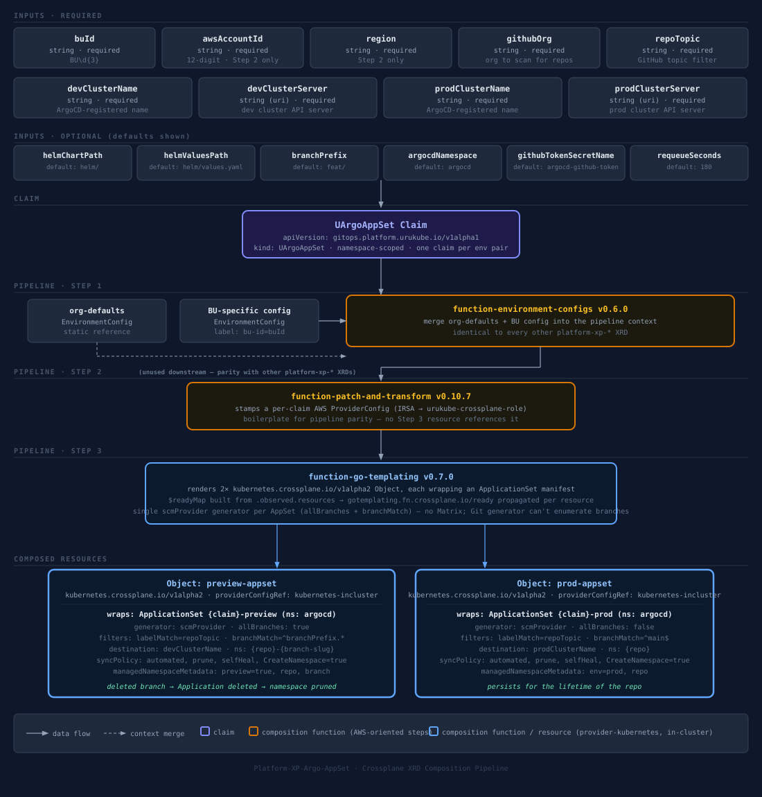

# platform-xp-argo-appset

Crossplane XRD package that provides a self-service GitOps preview + production deployment golden path for the `urukube` platform. ArgoCD auto-discovers this repo via the `platform-custom-xrds` GitHub topic and deploys it to `crossplane-system` on the orchestrator cluster.

A BU submits one `UArgoAppSet` claim per environment pair (dev + prod). The composition creates two ArgoCD `ApplicationSet` resources on the orchestrator cluster:

1. **Preview AppSet** — watches every repo in the GitHub org carrying `repoTopic`, deploys any branch matching `branchPrefix*` into a per-branch namespace on the dev cluster. Deleting or merging the branch prunes the Application and its namespace automatically.
2. **Production AppSet** — watches the same repos, tracks only `main`, and deploys into a stable per-repo namespace on the prod cluster.

## Composition pipeline



## What gets provisioned

Every `UArgoAppSet` claim creates two `argoproj.io/v1alpha1 ApplicationSet` resources in `argocdNamespace` (default `argocd`) on the orchestrator cluster itself, applied via `provider-kubernetes`:

| ApplicationSet | Generator | Deploys to | Lifecycle |
|---|---|---|---|
| `<claim>-preview` | SCM Provider (GitHub), `allBranches: true`, filtered by topic + `branchMatch: ^<branchPrefix>.*` | dev cluster, namespace `<repo>-<branch-slug>` | Pruned automatically when the branch is deleted or merged |
| `<claim>-prod` | SCM Provider (GitHub), `allBranches: false`, filtered by topic + `branchMatch: ^main$` | prod cluster, namespace `<repo>` | Persists for the lifetime of the repo |

Branch slugs are normalised as `{{ .branch | replace "/" "-" | lower }}` — e.g. `feat/add-stripe` → `feat-add-stripe`, giving namespace `payments-api-feat-add-stripe`.

### Why a single SCM Provider generator instead of a Matrix

ArgoCD's Git generator has no branch-enumeration capability — it only reads files/directories at a fixed revision. The correct, working construct for "every branch matching a prefix, across every repo with a topic" is the **SCM Provider generator** itself with `allBranches: true` plus a `branchMatch` filter; combining it with a second generator via `matrix` would be redundant. Both ApplicationSets therefore use a single `scmProvider` generator with `spec.goTemplate: true` so `{{ .repository }}` / `{{ .branch }}` / `{{ .url }}` are available in the Application template.

## Parameters

| Field | Required | Default | Description |
|---|---|---|---|
| `spec.parameters.buId` | Yes | — | Business Unit ID (e.g. `BU001`) |
| `spec.parameters.awsAccountId` | Yes | — | 12-digit AWS account ID. Required by the shared pipeline's patch-and-transform step only — not consumed by any resource here |
| `spec.parameters.region` | Yes | — | AWS region. Required by the shared pipeline's patch-and-transform step only |
| `spec.parameters.githubOrg` | Yes | — | GitHub organisation to scan for repos |
| `spec.parameters.repoTopic` | Yes | — | GitHub topic that marks repos eligible for preview + prod deployments |
| `spec.parameters.devClusterName` | Yes | — | ArgoCD-registered name of the dev cluster |
| `spec.parameters.devClusterServer` | Yes | — | Kubernetes API server URL of the dev cluster |
| `spec.parameters.prodClusterName` | Yes | — | ArgoCD-registered name of the prod cluster |
| `spec.parameters.prodClusterServer` | Yes | — | Kubernetes API server URL of the prod cluster |
| `spec.parameters.helmChartPath` | No | `helm/` | Path to the Helm chart inside each repo |
| `spec.parameters.helmValuesPath` | No | `helm/values.yaml` | Path to the base values file, relative to the repo root |
| `spec.parameters.branchPrefix` | No | `feat/` | Branch prefix that triggers preview deployments |
| `spec.parameters.argocdNamespace` | No | `argocd` | Namespace where ArgoCD is installed |
| `spec.parameters.githubTokenSecretName` | No | `argocd-github-token` | K8s secret in `argocdNamespace` holding the GitHub token (key: `token`) — created by ESO from `platform/github/github-token` in Secrets Manager |
| `spec.parameters.requeueSeconds` | No | `180` | How often the SCM generator polls GitHub for branch changes |

`devClusterName`/`prodClusterName` address the ArgoCD `Application.spec.destination.name` — the cluster must already be registered in ArgoCD, which happens automatically when its `UEksCluster` is provisioned via `platform-xp-eks`. `devClusterServer`/`prodClusterServer` are captured for operator cross-reference.

## Example claim

```yaml
apiVersion: gitops.platform.urukube.io/v1alpha1
kind: UArgoAppSet
metadata:
  name: bu001-gitops-platform
  namespace: bu001
spec:
  parameters:
    buId: BU001
    awsAccountId: "111111111111"
    region: us-east-1
    githubOrg: urukube
    repoTopic: platform-preview-enabled
    devClusterName: bu001-dev-eks
    devClusterServer: https://AAABBBCCC.gr7.us-east-1.eks.amazonaws.com
    prodClusterName: bu001-prod-eks
    prodClusterServer: https://DDDEEEFFF.gr7.us-east-1.eks.amazonaws.com
```

## What an app repo needs to participate

1. Add the GitHub topic matching `repoTopic` (e.g. `platform-preview-enabled`) on the repo settings page.
2. Have a Helm chart at `helmChartPath` (default `helm/`).
3. Name feature branches with the `branchPrefix` convention (default `feat/`).
4. Have its target cluster already registered in ArgoCD.

## Full flow

```
Developer pushes feat/add-stripe to payments-api repo (topic: platform-preview-enabled)
  │
  ▼
Preview AppSet SCM generator detects branch (next poll cycle, ≤ requeueSeconds)
  │
  ▼
ArgoCD creates Application: preview-payments-api-feat-add-stripe
Deploys helm chart from feat/add-stripe → namespace payments-api-feat-add-stripe (dev cluster)
  │
Developer merges feat/add-stripe → main, deletes branch
  │
  ├── Preview AppSet: branch gone → Application deleted → namespace + all resources pruned (dev cluster)
  │
  └── Production AppSet: main updated → Application prod-payments-api synced
      Deploys helm chart from main → namespace payments-api (prod cluster)
```

## In-cluster provider setup

Unlike the AWS providers used by other `platform-xp-*` repos, `provider-kubernetes` here talks to the orchestrator cluster's own API server — there is no cross-account role to assume. `provider.yaml` grants it a dedicated service account (`provider-kubernetes-incluster`) via `DeploymentRuntimeConfig`, scoped by a `Role`/`RoleBinding` to `create`, `update`, `patch`, `delete`, `get`, `list`, `watch` on `argoproj.io/applicationsets` in the `argocd` namespace only — it cannot touch any other resource in the cluster.

The `kubernetes-incluster` `ProviderConfig` (also in `provider.yaml`) is static — one per cluster, shared by every `UArgoAppSet` claim, referenced directly in `composition.yaml`.

The Step 2 AWS `ProviderConfig` is still generated per-claim for consistency with the shared pipeline used by every other `platform-xp-*` XRD, but nothing in this composition consumes it.

## Files

| File | Purpose |
|---|---|
| `provider.yaml` | Installs `provider-kubernetes:v1.2.6`; declares the `provider-kubernetes-incluster` `DeploymentRuntimeConfig`, its scoped `Role`/`RoleBinding` on the `argocd` namespace, and the static `kubernetes-incluster` `ProviderConfig` |
| `xrd.yaml` | Defines the `XUArgoAppSet` / `UArgoAppSet` API and parameter schema |
| `composition.yaml` | Maps a claim to the two `ApplicationSet` `Object` resources |
